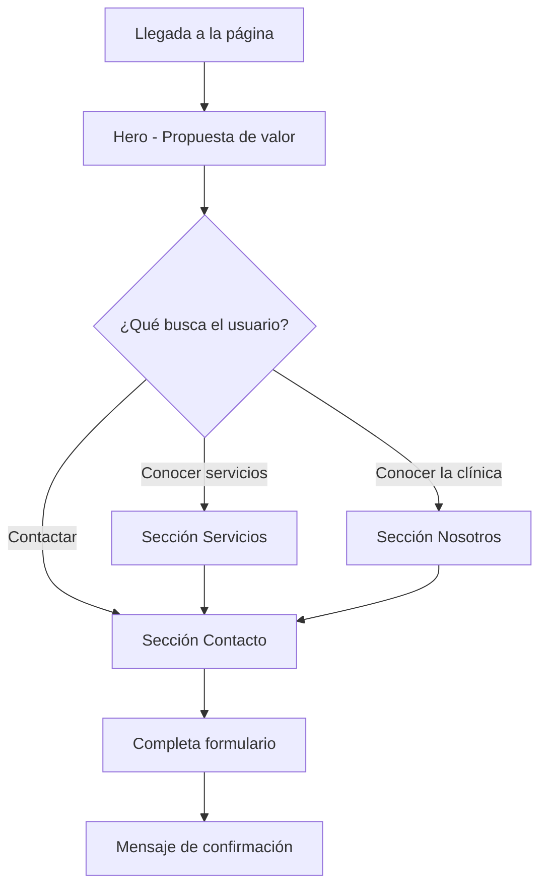

# Medic Toro - Flujo de Usuario

## Visión General

La landing page es de una sola página con navegación por anclas. El usuario llega, conoce los servicios y puede contactar a la clínica.

## Flujo Principal

## Secciones

| Sección    | ID          | Acción del usuario                    |
|-----------|-------------|---------------------------------------|
| Inicio    | `#inicio`   | Lee propuesta de valor, CTAs          |
| Servicios | `#servicios`| Explora tarjetas de servicios         |
| Nosotros  | `#nosotros` | Conoce estadísticas y valores         |
| Contacto  | `#contacto` | Envía formulario o ve datos directos|

## Navegación

- **Header sticky**: enlaces a cada sección + botón "Agendar cita"
- **Menú móvil**: hamburguesa en pantallas pequeñas
- **Footer**: enlaces repetidos y copyright

## Formulario de Contacto

1. Usuario completa nombre, email, teléfono (opcional) y mensaje
2. Al enviar, se muestra mensaje de éxito
3. Los campos se reinician (sin envío real a servidor por ahora)
