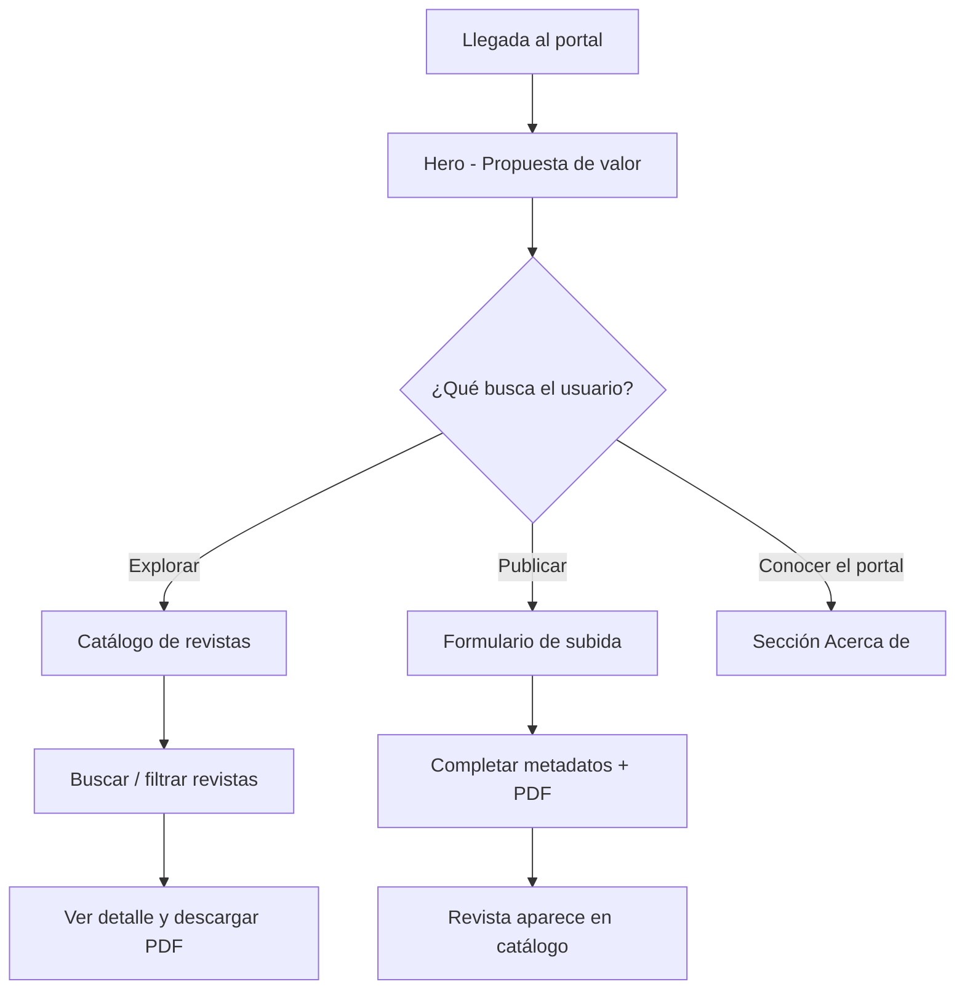

# Medic Toro - Flujo de Usuario

## Visión General

Portal de una sola página donde investigadores y profesionales médicos pueden consultar y publicar revistas de investigación.

## Flujo Principal

## Secciones

| Sección          | ID            | Acción del usuario                         |
|------------------|---------------|--------------------------------------------|
| Inicio           | `#inicio`     | Conoce el portal, CTAs principales         |
| Revistas         | `#revistas`   | Busca, filtra y consulta publicaciones     |
| Subir            | `#subir`      | Publica una nueva revista en PDF           |
| Acerca de        | `#nosotros`   | Conoce la misión y estadísticas del portal   |

## Subida de Revista

1. Usuario completa título, autores, especialidad, edición y resumen
2. Adjunta archivo PDF
3. Al enviar, la revista se agrega al catálogo inmediatamente
4. Los datos persisten solo en la sesión actual (sin backend aún)

## Catálogo

1. Usuario busca por texto o filtra por especialidad médica
2. Ve tarjetas con metadatos de cada revista
3. Puede descargar PDF (placeholder hasta integrar almacenamiento)
